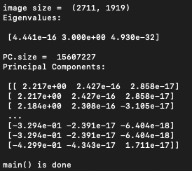

# ECE 47700 Team 10 - Sign2Sound
Sign2Sound is a semi-portable ASL translator for the 24 stationary letters of the ASL alphabet. The device consists of a microcontroller, host computer, camera, character display, touch screen display, speaker, and right-handed color glove. The device streams feedback from the camera to the embedded touch screen, allowing the user to frame their gloved hand properly for the camera to capture it. The glove makes ASL sign recognition less biased by standardizing differences in the users’ hand shape, size, and color. Once the user is ready, they can press a button to trigger an image capture. Next, the image is processed on the host computer that houses the team-designed computer vision algorithm, associating signs with their English alphabet translation. Then, the corresponding translation is sent to the microcontroller via UART. The microcontroller then outputs the translated letter data both on the character display and speaker. For the audio output, the microcontroller transmits the identified letter’s audio file to a DAC module via I2C. Subsequently, the converted analog signal is output from the DAC to a speaker using a team-designed amplifier circuit. As for the visual output, the microcontroller transmits the identified letter to the character display via SPI. The device will be powered by a wall wart transformer, supplying 5V directly to the host computer. Power will be fed from the host computer to an LDO to reduce the voltage to 3.3V for the microcontroller.

## Team Members
- Team Leader: Jenna Gillette
- Software Engineer: Caroline Gilbert
- Systems Engineer: Becca Horwatt
- Hardware Engineer: Kaushik Karthikeyan

## Computer Vision Algorithm
### Virtual Environment (Conda)
Use a virtual environment to install the required dependencies for the computer vision algorithm.

See [Virtual Environment Dependencies](pca-test/cv-env.yml)

Navigate to the pca-test folder and run the following commands to activate a virtual environment on Anaconda to install and run the notebook:
- Create a new virtual environment `cv-env` from the [cv-env.yml](pca-test/cv-env.yml) dependencies:

    ```
    conda env create -f cv-env.yml
    ```

- Activate the environment:
    ```
    conda activate cv-env
    ```

- After finishing work in environment, deactivate it
    ```
    conda deactivate
    ```
- Delete environment if needed
    ```
    conda remove -n cv-env --all
    ```

### Image Preprocessing
Principal component analysis (PCA) is a dimensionality reduction method utilized in image preprocessing to flatten image data. After capturing the user's ASL image on the Raspberry Pi camera, the Raspberry Pi performs PCA on the captured image to prepare the data for the KNN algorithm. To run the PCA script, execute the following command:

Run the [pca.py](pca-test/pca.py) script to performa PCA on the [color-glove1.jpb](pca-test/color-glove1.jpg) image:

```
python pca-test/pca.py
```

The output should match the image below.


